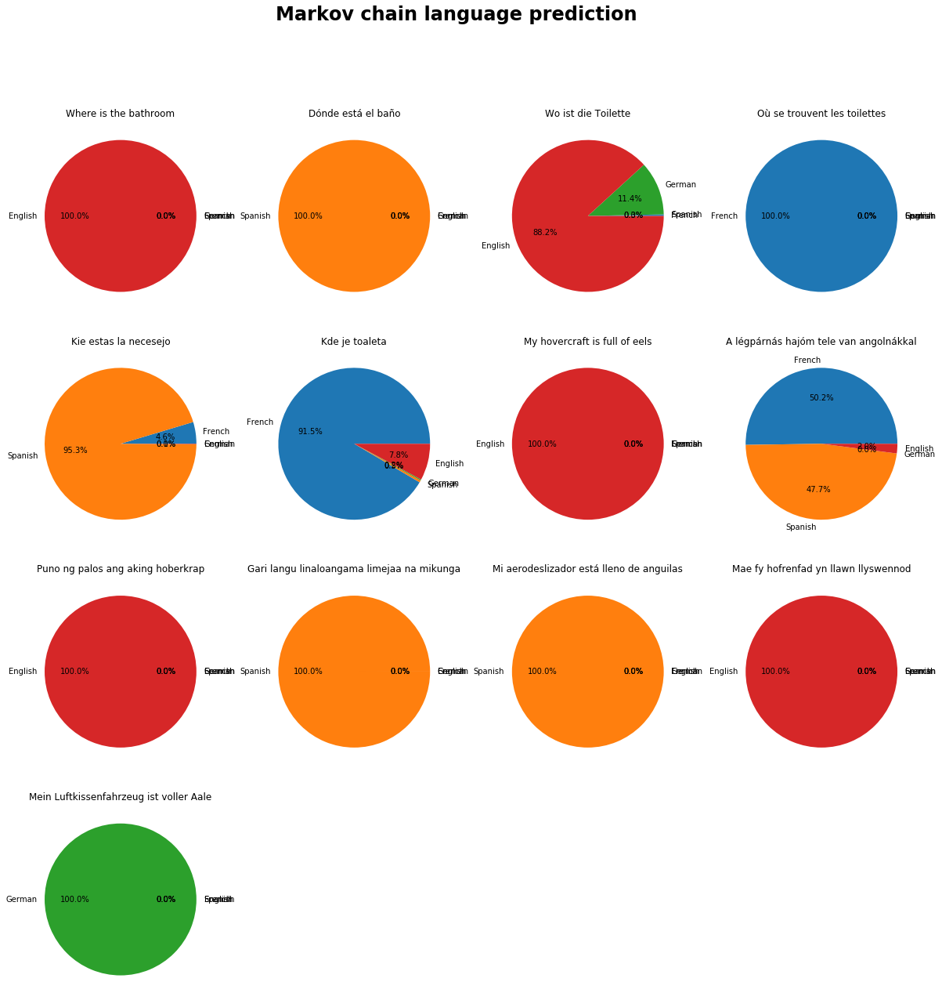

## Materials

*   [Candide](../data/candide.txt) in French
*   [Don Quijote](../data/quijote.txt) in Spanish
*   [Alice In Wonderland](../data/wonderland.txt) in English
*   [Also Sprach Zarathustra](../data/zarathustra.txt) in German
*   [Lab Starter Code](http://nbviewer.jupyter.org/url/hendrix-cs.github.io/csci270/notes/Lab%207%20Starter%20Code.ipynb)
*   [latin2.txt](../data/latin2.txt)

## Detecting Language

When modern browsers like Chrome visit a webpage, there is sometimes an option to automatically translate the text into English from another language. How does the browser detect other languages? One way is to pass the text of the webpage through prebuilt Markov chains for many languages, and determine which language has the highest probability of generating this text.

Download the four classic books above, and learn the probabilities for an order 1 Markov chain that models the adjacent letter patterns found in each of the given languages. Your states in the Markov chain will be each possible letter in any of the four languages and the space character. To simplify your setup, place these books in a folder titled `book-markov`.

The Markov chain should be fully connected, so that any state can be followed by any other state. Use the concept of a [pseudocount](http://en.wikipedia.org/wiki/Pseudocount) to initialize every possible observation to be 1, then increment these counts for the adjacent pairs found in the text, and finally normalize your counts to be probabilities.



Use your learned Markov Chains to predict the language used in the following phrases. Clearly show the probabilities found for each of the four possible languages.

*   Where is the bathroom
*   Dónde está el baño
*   Wo ist die Toilette
*   Où se trouvent les toilettes
*   Kie estas la necesejo
*   Kde je toaleta
*   My hovercraft is full of eels
*   A légpárnás hajóm tele van angolnákkal
*   Puno ng palos ang aking hoberkrap
*   Gari langu linaloangama limejaa na mikunga
*   Mi aerodeslizador está lleno de anguilas
*   Mae fy hofrenfad yn llawn llyswennod
*   Mein Luftkissenfahrzeug ist voller Aale

When your model is working, you should get the following probabilities.

{: .img-fluid}

## Generating Language

Use the Markov chain code we wrote in class to generate a random 200 word text from our corpus.
This should be generated from a sequence of **words**.
Reformat your generated text to have proper capitalization, line breaks, etc.
You can choose whatever order you like, I suggest between 3 and 5, but the text must be somewhat
intelligible and include pieces from at least three books.

Use the Markov chain code we wrote in class to generate 4 random two-word spells as found in
Harry Potter, from the words in [latin2.txt](../data/latin2.txt). You can generate more
and pick your favorite 4. This should be generated using a
sequence of **letters**. Again, I suggest using an order between 3 and 5.
Write definitions for each of your spells describing their effects and how they should be used.
